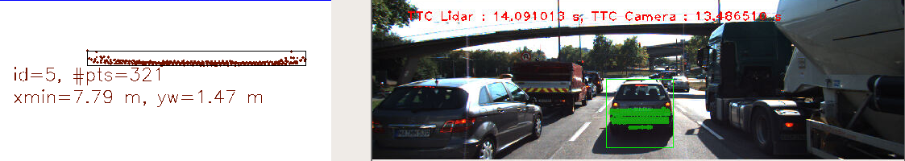
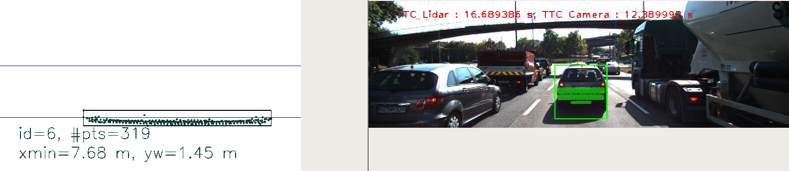
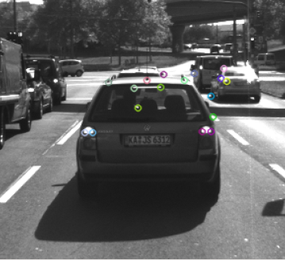
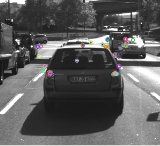

# SFND 3D Object tracking - Final report

## **FP.1 : Match 3D Objects**
    This topic was addressed by means of the implementation of the function
    "matchBoundingBoxes" in the file "camFusion_Student.cpp".

## **FP.2 : Compute Lidar-based TTC**
    This topic was addressed by means of the implementation of the method
    "computTTCLidar" in the file "camFusion_Student.cpp".
    The method is able to handle outliers in the point cloud cluster of the 
    previous and current vehicle by choosing the median of the sorted lidar points inside 
    the region of interest, assuring in that form robustness against outliers which might 
    be way too close and thus lead to faulty estimates of the TTC as was intended.

## **FP.3 : Associate Keypoint Correspondences with Bounding Boxes**
    This topic was addressed by mean of the implementation of the method "clusterKptMatchesWithROI"
    in the file "camFusion_Student.cpp". To address the outlier matches I made the calculation of the 
    euclidean distance mean of all the matches, and afterwards only considered those matches that are 
    not too far away from that same mean value.

## **FP.4 : Compute Camera-based TTC**
    This topic was addressed by means of the implementation of the method "computeTTCCamera" in the file 
    "camFusion_Student.cpp". The time was calculated from the mean distance between all the keypoints within the 
    region of interest, so that the outliers were not considered in this calculation.

## **FP.5 : Performance Evaluation 1**
    1- I noticed an increase in the TTC from 12.61s (at 2-3 frames) to 14.09s (at 3-4 frames).      

    2- I noticed an increase in the TTC from 14.09s (at 3-4 frames) to 16.69s (at 4-5 frames). 

    The reason for those errors regarding the TTC calculations is due to the constant velocity 
    model being broken, both in the LiDAR and camera-based estimation and issues with matching 
    using the camera-based methods. 
    The constant velocity model does not function correctly when the car is decelerating, which 
    is the case in this data. Also, the TTC for the camera version is completely dependent on 
    the feature detector and descriptor chosen so these need to be improved. 

## **FP.6 : Performance Evaluation 2**

    > Best Detector & Descriptors (Green highlight)

        a. Best Detector + Descriptor: the combination of detector and descriptor that gave the lowest standart 
        deviation in terms of the TTC was FAST detector with BRISK descriptor, only 0.94 of standart deviation.
        
        b. Best Detector overall considering all the descriptor results: was the SHITOMASI detector, where the lowest
        standart deviation of TTC was 1.15 and the greatest was 2.43.

        c. Second Detector overall considering all the descriptor results: was the AKAZE detector, where the lowest
        standart deviation of TTC was 2.15 and the greatest was 2.27.
    
    > Worst Detector & Descriptors (yellow highlight)

        a. The Harris detector gave some errors regarding the TTC, some values were large negatives or positives.
        One of the possible reasons for that kind of errors is due to the fact that the Harris detector is only able
        to identify a lot less keypoints compared to other detectors, leading to limited distance ratio calculation and
        wrong calculation.

        b.  The Orb detector also gave some errors regarding the TTC, some values were large negatives or positives.
        One of the possible reasons for that kind of errors is also due to the fact that the ORB detector retrieves 
        few keypoints, and most of them are not landing the preceding car at all, leading to skewed results.

    > LIDAR considerations regarding TTC values: the values regarding the LIDAR TTC were constant across 
    the several combinations of Detector & Descriptors. The only step in the LIDAR TTC computation where
    Detectors & Descriptors were used was when there was an assignment of the bouding box to each lidar point,
    in this step all the different combinations gave the same bouding box id, so the results were constant across 
    the several combinations of detectors & descritors.