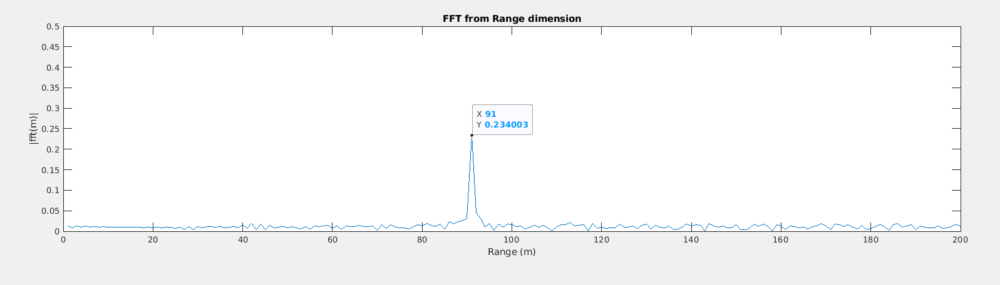

# Radar Target Generation and Detection ##

## Project Layout #

- Configure the FMCW waveform based on the system requirements.  
- Define the range and velocity of the target and simulate its displacement.  
- For the same simulation loop process the transmit and receive signal to determine the beat signal.  
- Perform Range FFT on the received signal to determine the Range.  
- Towards the end, perform the CFAR processing on the output of the 2nd FFT to display the target.


### 1. System requirements

System Requirements define the design of a Radar.   
The sensor fusion design for different driving scenarios requires different system configurations from a Radar.  
The system requirements for this specific radar are stated below:

|Specifications | Values |
|---|---|
| Frequency           | 77 GHz    |
| Range Resolution    | 1 m       |
| Max Range           | 200 m     |
| Max Velocity        | 70 m/s    |
| Velocity Resolution | 3 m/s     |

### 1.1 Radar parameters

```matlab
rangeMax = 200;             % maximum range (m)
radarRangeResolution = 1;   % radar range resolution (m)
vMax = 70;                  % maximum velocity (m/s)
c = 3.0e8;                  % speed of light (m/s)
```
### 1.2 Radar derived parameters

From the parameters above, we can calculate the following radar specifications:

```matlab
Bsweep = c/(2*radarRangeResolution);    % sweep bandwith (Hz)
Tchirp = 5.5*2*rangeMax/c;              % sweep time (s)
slope = Bsweep/Tchirp;                  % slope of the FMCW chirp (Hz/s)
```

### 2. Initial Range and velocity of the target (User defined)

The initial position of the target and the target constant velocity 
are user defined. Constrains on the target initial position, should be <= 200m,
and the constrain on the target velocity should be <= 70 m/s, in absolute value.

```matlab
targetRangeInitial = 90;        % target initial position (m)
targetVelocity = 40;            % target velocity (m/s)
```

### 3. Radar signal propagation

FMCW transmit and receive signals are defined by the wave equations.  
The 'a' parameter is defined as the slope of the chirp signal.  
The received signal is a time delayed version of the transmitted signal.  

When we mix those signals, we have a frequency subtraction of the carrier frequency,  
and we get the beat signal frequency that can later with the help of the FFT extract   
the value of the range and the Doppler. The mix of those signals is done by means of  
an element wise matrix multiplication of Tx.*Rx signals.


The code that performs the mix of those signals uses a loop to iterate all the  
timestamps t, the actual target range is calculated using the constant velocity model,  
and the Tx(t) & Rx(t) using the wave equations from above. In the end, the beat signal   
is calculated using the element wise multiplication of Tx and Rx.  


```matlab
%% Signal generation and Moving Target simulation
% Running the radar scenario over the time. 
alpha = slope;
r_t = targetRangeInitial + targetVelocity * t;
td = 2 * r_t / c;
Tx = cos(2*pi*(fc*t + (alpha*(t.^2)/2)));
Rx = cos(2*pi*(fc*(t - td) + (alpha*((t - td).^2)/2)));
Mix = Tx .* Rx;
```

### 4. FFT calculation

The FFT in the range dimension was performed using as input the mixed/beat signal calculated above.  
The FFT output is a peak in the 91 m range dimension, very close of the user defined 90 m target initial  
position.



After the first FFT, it was calculated the 2D FFT across the range and Doppler dimension, enabling the  
extraction of the range and Doppler information, Range Doppler Map (RDM). From the output we got a good  
approximation of the initial range of the target (90.68 m) as well as the target constant velocity (40.16 m/s).


### 5. 2D CFAR

The 2D CFAR (Constant False Alarm Rate) is a technique used in radar signal processing to detect  
targets in the presence of clutter.  
It is called 2D because it operates on a two-dimensional Range-Doppler map.

The main goal of CFAR is to determine a threshold that can differentiate between the target and  
the clutter. This threshold is adaptive and varies based on the local environment.  
CFAR takes into account the statistical properties of the clutter and adjusts the threshold accordingly.

The process of 2D CFAR involves the following steps:

- Determine the number of training cells for each dimension and select the number of guard cells.  
The training cells are used to estimate the statistical properties of the clutter, while the guard  
cells provide a buffer zone between the training cells and the cell under test (CUT).

- Slide the CUT across the complete Range-Doppler map, making sure it has a margin for training and  
guard cells from the edges.

- For each iteration, sum the signal level within all the training cells.  
Convert the summed value from logarithmic to linear using the db2pow function.

- Average the summed values for all the training cells used.  
After averaging, convert it back to logarithmic using the pow2db function.

- Add an offset to the averaged value to determine the threshold.

- Compare the signal under the CUT against this threshold. If the CUT level is greater than  
the threshold, assign it a value of 1; otherwise, assign it a value of 0.

- The result of this process is a thresholded block, which is smaller than the original Range-Doppler  
map because the CUTs cannot be located at the edges of the matrix due to the presence of target and  
guard cells. The non-thresholded cells are then set to 0 to maintain the same map size as before CFAR.
  
  
  
In terms of the definition of the number of training and guard cells, the parameters used in the project were:

```matlab
% Select the number of Training Cells in both the dimensions.
Td = 8;
Tr = 8;

% Select the number of Guard Cells in both dimensions around the Cell under 
% test (CUT) for accurate estimation
Gd = 4;
Gr = 4;

% offset the threshold by SNR value in dB
offset = 6;
```
The selection of Training cells, Guard cells and offset need to be chosen based on the specific  
environment and system configuration. If a dense traffic situation were to happen, then fewer  
training cells should be used - closely spaced targets can impact the noise estimate.  
The number of guard cells on the other hand should be chosen based on the leakage of the target  
signal out of the cell under test. In general, the number of leading and lagging training cells   
are the same. The offset value should be based on the leakage of the target signal to allow valid  
targets to be detected at the same time suppresses the clutter noise.

The rest of the points above were executed in the following matlab code:

```matlab
% for loop that iterate by each row (Range dimension)
for i = (Tr+Gr+1) : (Nr/2-Gr-Tr)
    % for loop that iterate by each column (Doppler dimension)
    for j = (Td+Gd+1) : (Nd-Gd-Td)
        noiseLevelSum = 0;
        numberElementsSum = 0;
        % for loop to sum the training cells in the row dimension
        for r = (i-Tr-Gr) : (i+Gr+Tr)
            % for loop to sum the training cells in the column dimension
            for c = (j-Td-Gd) : (j+Gd+Td)
                if(abs(r-i) > Gr && abs(c-j) > Gd)
                    % update average parameters
                    noiseLevelSum= noiseLevelSum+db2pow(RDM(r,c));
                    numberElementsSum=numberElementsSum+1;
                end
            end % end c
        end % end r

        % averaging the noise
        noiseLevelAverage = noiseLevelSum/numberElementsSum; % linear
        % linear to db scale
        noiseLevelAverageDb = pow2db(noiseLevelAverage); % db
        % add the offset also in db scale
        noiseThreshold_Db = noiseLevelAverageDb + pow2db(offset); % db

        % test Cell Under Test - CUT
        if(RDM(i,j) > noiseThreshold_Db)
            filteredMapping(i,j) = 1;
        end

    end % end j
end % end i
```

In this code, the first for loop iterate by the range dimension, 
the second for loop iterates by the Doppler dimension, in both for loops,
the index of the CUT is (i,j) and already takes into account the space for the  
training and guard cells.
The other two inside loops r and c take care of determining the average of the training cells 
FFT, after the average is calculated, the offset is added into the average and then the 
CUT FFT value is compared to the noise threshold calculated before, if it is greater than 
the (i,j) index is stored as 1 in the filtered map, if not it remains as 0.

The CFAR result shown below indicates the velocity target of about 40 m/s.

